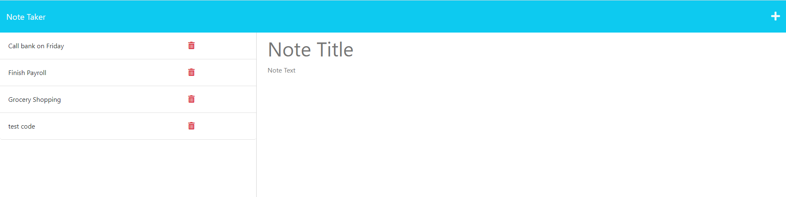

# Note Taker Starter Code

Given a started code, the objective is to make the app work properly by creating the proper ROUTES so that the user can add notes and see a list of all existing notes previously created.

## USER STORY

AS A small business owner
I WANT to be able to write and save notes
SO THAT I can organize my thoughts and keep track of tasks I need to complete

### ACCEPTANCE CRITERIA

GIVEN a note-taking application 
WHEN I open the Note Taker 
THEN I am presented with a landing page with a link to a notes page 
WHEN I click on the link to the notes page 
THEN I am presented with a page with existing notes listed in the left-hand column,  
plus empty fields to enter a new note title and the note’s text in the right-hand column 
WHEN I enter a new note title and the note’s text 
THEN a Save icon appears in the navigation at the top of the page 
WHEN I click on the Save icon 
THEN the new note I have entered is saved and appears in the left-hand column with the 
other existing notes 
WHEN I click on an existing note in the list in the left-hand column 
THEN that note appears in the right-hand column 
WHEN I click on the Write icon in the navigation at the top of the page 
THEN I am presented with empty fields to enter a new note title and the note’s text in 
the right-hand column

## The following is a screenshot of the final product:

## Click [here](https://github.com/dolivafig/to_do) to see the repo on gitHub.
## Click [here](https://immense-caverns-74822.herokuapp.com/) to run the app using Heroku.
